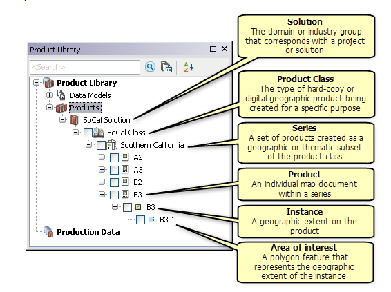

# maritime-product-library-samples

Template product library geodatabases for the ArcGIS for Maritime: Charting product

## Features
* Sample AML product library workspace XML
* Sample ENC product library workspace XML
* Sample IENC product library workspace XML

## Instructions

1. Go to the subfolder corresponding to the product type you are interested in (AML, ENC or IENC)
2. Download the zipped product library workspace XML that corresponds to the version of ArcGIS for Maritime: Charting you are working with.
3. Import the workspace XML into a Geodatabase. For help, see [online help topic](http://desktop.arcgis.com/en/desktop/latest/manage-data/geodatabases/importing-feature-datasets-classes-and-tables-from-an-xml-workspace-document.htm)

## Requirements

* ArcGIS for Maritime: Charting 10.3.1 and above

## Resources

* [ArcGIS for Maritime: Charting online product page]( http://www.esri.com/software/arcgis/extensions/maritime/charting)
* [online help topic]( http://desktop.arcgis.com/en/desktop/latest/manage-data/geodatabases/importing-feature-datasets-classes-and-tables-from-an-xml-workspace-document.htm)

## Issues

Find a bug or want to request a new feature?  Please let us know by submitting an [issue](../../issues).

## Contributing

Esri welcomes contributions from anyone and everyone. Please see our [guidelines for contributing](https://github.com/esri/contributing).

## Licensing
Copyright 2015 Esri

Licensed under the Apache License, Version 2.0 (the "License");
you may not use this file except in compliance with the License.
You may obtain a copy of the License at

   http://www.apache.org/licenses/LICENSE-2.0

Unless required by applicable law or agreed to in writing, software
distributed under the License is distributed on an "AS IS" BASIS,
WITHOUT WARRANTIES OR CONDITIONS OF ANY KIND, either express or implied.
See the License for the specific language governing permissions and
limitations under the License.

A copy of the license is available in the repository's [license.txt](license.txt?raw=true) file.
